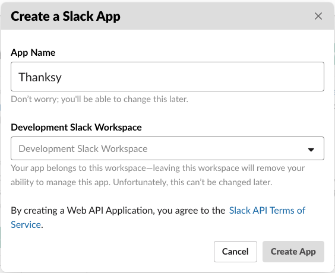
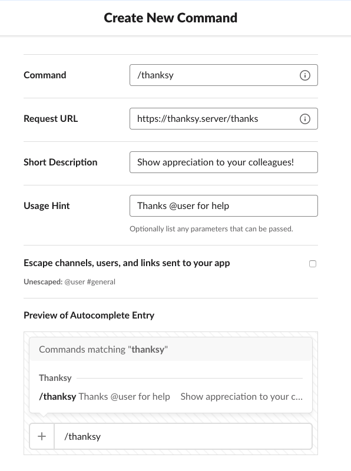
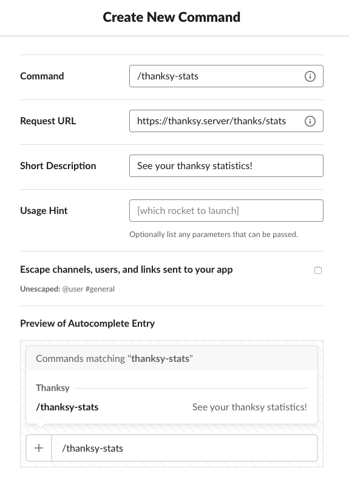
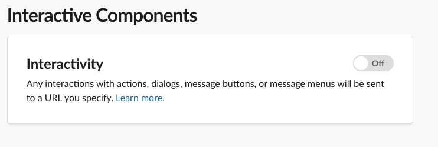
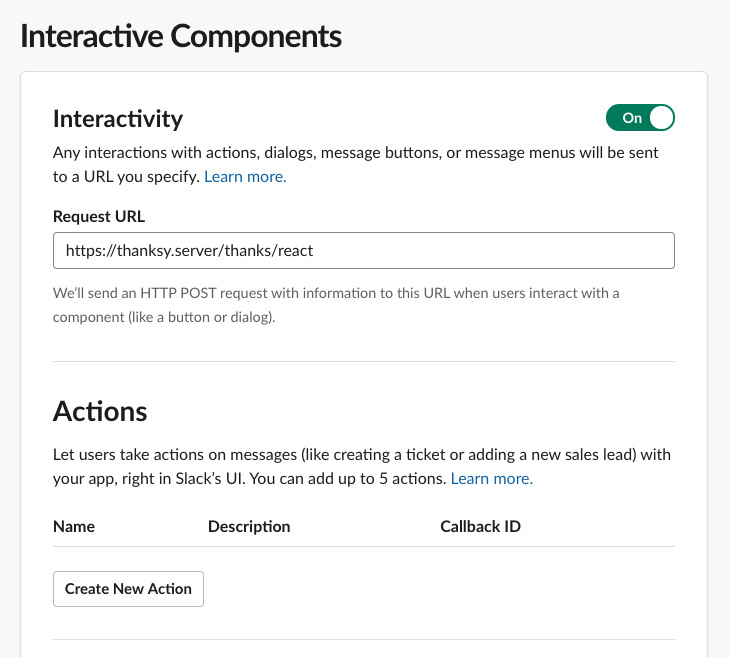
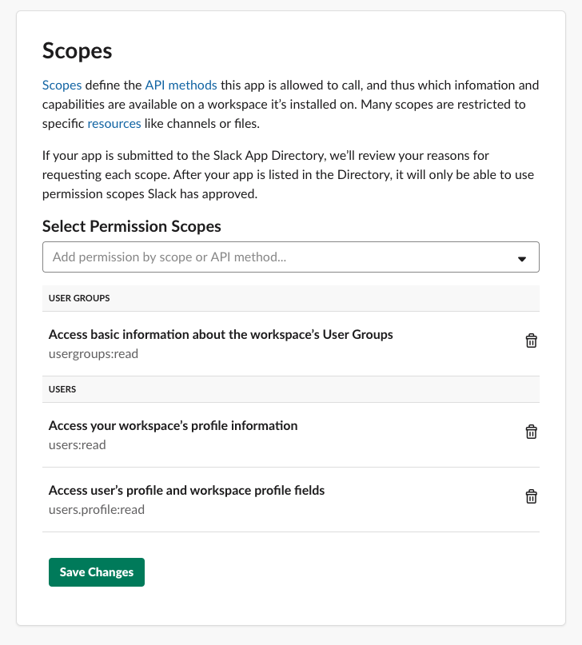
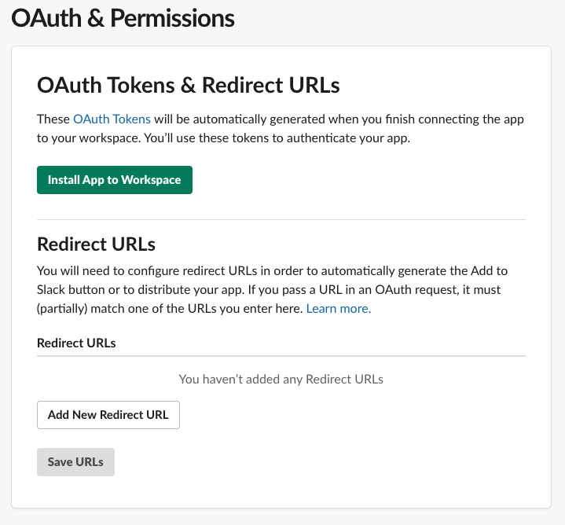

# Thanksy

## Step 1: App deployment

    heroku create
    git push heroku master
    heroku buildpacks:set heroku/nodejs
    heroku run rake db:migrate
    heroku open

Alternatively, you can deploy your own copy of the app using the web-based flow:

## Step 2: Building slack app

1. Visit the [Slack API vebsite](https://api.slack.com/) and click the `Start Building` button.
Then you will see the following popup. Fill in the name of the application (We recommend name `Thanksy`) and select your workspace.

2. The next step is to configure two commands. Click `Features -> Slash Commands` and use the `Create New Command` option to create them.
Remember to enter the appropriate server address. Replace the `thanksy.server` placeholder with the address of the application you deployed in the previous step.

3. `Click Features -> Interactive Components` and turn them on.

4. Fill in the `Request URL` used to send slack reactions. Replace the `thanksy.server` placeholder with the address of the application you deployed in the previous step.

5. At this step, specify a scopes. Thanksy saves some data to minimize the number of requests to the `Slack API` . To fetch this data, we require the following permissions:

6. If the scopes have been defined you can install you app.

7. Last but not least. You must add three env variables in the options of your project on heroku. `SLACK_TOKEN` can be found in the `Basic Information -> App Credentials` section. It is called `Verification Token`. `SLACK_API_TOKEN` is located in the `OAuth & Permissions -> OAuth Tokens & Redirect URLs` section. `AUTH_TOKEN` is generated by you. It is simple method of authorization between frontend app and thanksy backend.

8. Enjoy:) 

## Contributing

In general, we follow the "fork-and-pull" Git workflow.

1. Fork the repo on GitHub
2. Clone the project to your own machine
3. Commit changes to your own branch
4. Push your work back up to your fork
5. Submit a Pull request so that we can review your changes

NOTE: Be sure to merge the latest from "upstream" before making a pull request!

## Development

### Prerequisites

    ruby 2.6.1

### PostgreSQL

If you don't have `PostgreSQL` locally, you can start a `Docker` container with following command:

    ./scripts/run_postgres.sh

### Fill .env

    cp .env.example .env

Then fill missing options in the `.env` file.

### Install dependencies

    bundle install

### Setup db

    rake db:recreate
    rake db:migrate

### Run the server

    rails s

### Run tests

    rspec
